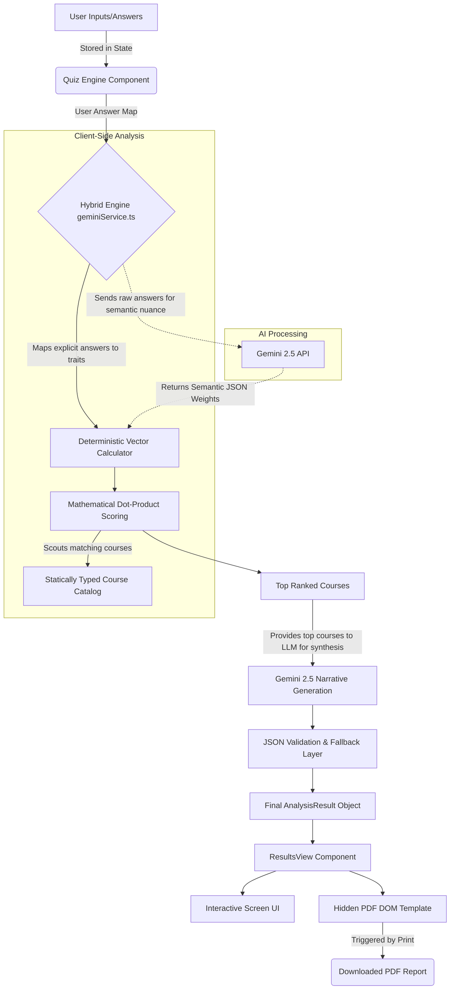

# Pathfinder AI: Comprehensive System Architecture & Methodology Report

## 1. Executive Summary
Pathfinder AI is an advanced, client-side, single-page web application designed to deliver highly personalized career and academic recommendations. Unlike traditional quizzes that map simple inputs to static outputs, Pathfinder utilizes a proprietary **Hybrid Recommendation Engine**. This engine mathematically scores user inputs against a vast, statically-typed database of real-world academic programs, and then utilizes Generative AI strictly for personalized narrative synthesis, ensuring recommendations are both statistically robust and highly engaging.

---

## 2. Technology Stack & Infrastructure

The application is built using a modern, scalable Frontend architecture, optimizing for speed, client-side processing, and seamless user experience without requiring a traditional backend server for data processing.

### **Core Frontend Framework**
*   **React 19**: Leverages the latest React paradigms (Concurrent rendering, Hooks) for managing complex, interactive UI states (like the quiz flow and dynamic results rendering).
*   **Vite 6**: An ultra-fast build tool and development server that provides near-instant Hot Module Replacement (HMR) and highly optimized production builds leveraging Rollup.
*   **TypeScript (v5.8)**: Enforces strict static typing across the entire codebase. This is critical for maintaining the integrity of the `Course` interfaces, validating API responses, and ensuring the complex recommendation algorithms do not suffer from runtime type errors.

### **Routing & Navigation**
*   **React Router DOM (v7)**: Manages client-side routing. It enables a seamless Single Page Application (SPA) experience, moving the user from the `/` (Quiz) to `/results` (Analysis) and potentially to payment gateways without ever reloading the browser page.

### **Styling & UI Experience**
*   **Tailwind CSS (v4) with PostCSS**: A utility-first CSS framework used for rapid UI development. It ensures a highly responsive design across mobile and desktop.
*   **Custom CSS (`index.css`)**: Contains essential global overrides, specifically complex `@media print` rules necessary for forcing pixel-perfect PDF generation across different device viewports.
*   **Lucide React**: Provides lightweight, scalable SVG icons used throughout the interface for visual enhancements.

### **Data Visualization**
*   **Recharts**: A composable charting library built on React components. Used specifically to generate the dynamic "Skill Signature" Radar Chart, translating the user's psychometric vector into an easy-to-understand visual web.

### **Artificial Intelligence Integration**
*   **Google Gemini API (`@google/genai`)**: Connects directly to the `gemini-2.5-flash` model. Crucially, the AI is constrained using strict `responseSchema` (JSON enforcement) and system instructions to prevent hallucinated data and ensure predictable, parseable outputs.

### **Local Export & Report Generation**
*   **Browser Native Print DOM Manipulation**: The application utilizes complex CSS constraints (`page-break-after`, `max-height: 1123px`, `width: 794px`) combined with `window.print()` to generate perfect A4 PDF reports. This approach bypasses the limitations and rendering bugs common in third-party canvas-to-PDF libraries (like `html2pdf.js`), ensuring text remains selectable and vectors remain sharp.

---

## 3. System Architecture & Data Flow

The architecture is designed to collect data, mathematically process it locally for speed and privacy, and only use external APIs for the final narrative polish.

### Component Breakdown
1.  **`App.tsx`**: The root configuration component. It defines the application routes and acts as the top-level state provider if context is needed.
2.  **`pages/QuizPage.tsx`**: Manages the state machine of the quiz. It handles transitions between introduction screens, question cards, and the final transition out of the quiz loop.
3.  **`components/QuestionCard.tsx`**: A highly reusable component capable of rendering various input modalities (Standard options, Image cards, Multi-select, Sliders) based on the question schema defined in `constants.ts`.
4.  **`pages/ResultsPage.tsx` & `components/ResultsView.tsx`**: The core visualization layer. It takes the deeply nested `AnalysisResult` object and maps it to engaging, animated UI components (Archetype headers, Vision Boards, Radar charts).
5.  **`components/PDFReportTemplate.tsx`**: A specialized, hidden DOM tree. It mirrors the data in `ResultsView` but is styled exclusively for A4 print metrics, ensuring the final exported document is professionally formatted and paginated.

---

## 4. The Hybrid Recommendation Methodology

The core intellectual property of the application resides in `services/geminiService.ts`. The process is explicitly structured to prevent the common flaw in AI-career planners: *LLM Hallucinations*.

### Phase 1: Feature Extraction (The Psychometric Vector)
When a user completes the quiz, their answers are analyzed through two parallel streams to build a 6-dimensional skill signature:
1.  **Deterministic Baseline (`calculateBaseVector`)**: Hardcoded rules map explicit choices to specific traits. For example, selecting "Numbers & Data" explicitly adds `1.0` weight to `Quantitative Analysis` and `Statistics`. This ensures mathematical reliability.
2.  **Semantic Nuance (`extractUserVector`)**: The raw text of the answers is sent to Gemini. The LLM acts as a semantic engine, finding latent patterns (e.g., inferring high `Empathy` because the user requested careers involving "supporting local communities").
*   **The Merge**: The two vectors are merged mathematically. Deterministic (user-chosen) values receive a heavy multiplier (`1.5x`) to respect user autonomy, while AI inferred values receive a lower multiplier (`0.4x`) to act only as a nuanced modifier.

### Phase 2: Mathematical Course Scouting
Instead of asking an LLM "What should this user do?", the system handles matching entirely client-side.
1.  **Dot Product Calculation**: The user's finalized **Psychometric Vector** is multiplied against the predefined vectors of hundreds of courses in the `COURSE_CATALOG`.
2.  **Preference Boosting**: If a user explicitly requested a specific subject (e.g., "Biology") or a Master's degree, courses tagged with those parameters receive massive mathematical bonus scores (e.g., `+2500`).
3.  **Spike Analysis**: The algorithm identifies if a user has a rare, extreme aptitude (a "Spike" in a specific trait) and boosts courses that require that specific outlier skill.
*   **Result**: A list of mathematically sound, highly relevant course recommendations sorted by a definitive `tempScore`.

### Phase 3: AI Narrative Generation
The top mathematically verified courses are sent *back* to the Gemini API alongside the user's profile. Inside a strict JSON schema prompt, the AI is instructed to function purely as a creative writer.
It generates:
*   An **Insta-Worthy Archetype** (e.g., "The Bio-Digital Architect").
*   Personalized explanations hooking the specific course to the user's explicit quiz answers.
*   A **"Day in the Life"** vision board narrative.
*   A fully contextualized script designed for the **Web Speech API** to read aloud to the user.
*   A personalized letter addressed to the parents explaining the methodology and validating the student's choices.

### Phase 4: The Validation Layer
Because LLMs can occasionally mutate strings, the final output undergoes strict validation.
* If the AI accidentally renames a recommended course (e.g., changing "B.Tech Computer Science" to "Bachelors in Coding"), the validation layer catches it by cross-referencing `VALID_COURSE_NAMES`.
* If a hallucination is detected, the system safely overwrites the AI's output with the mathematically highest-ranked valid course from Phase 2, ensuring 100% data integrity before rendering the screen or the PDF report.
rever the gemin 

####